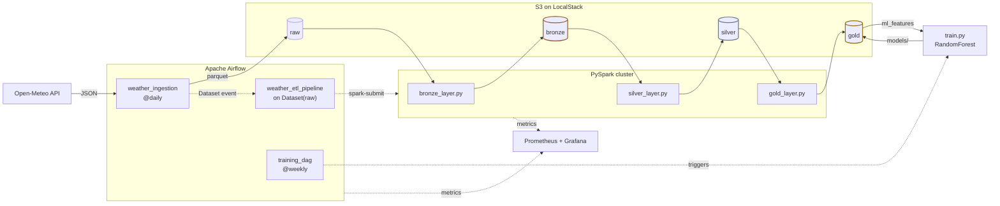

#  Open-Source Cloud Stack

A production-grade Data Engineering project simulating AWS infrastructure locally using **LocalStack**, orchestrated with **Apache Airflow**, processed with **PySpark**, and provisioned with **Terraform**.

## Architecture Overview

Weather data from the [Open-Meteo API](https://open-meteo.com/) (New York, Los Angeles and Chicago)
flows through a bronze → silver → gold data lake on LocalStack S3. Each stage is triggered by the
arrival of the previous one's data, and a forecasting model is trained on the gold layer.



Solid arrows carry data; dashed arrows are Airflow triggers and metrics. This is the **target**
architecture: the pipeline is being migrated to it step by step.

## 🛠️ Tech Stack (100% Open-Source / Free)

| Layer | Tool | Replaces |
|-------|------|---------|
| Cloud Storage | LocalStack S3 | AWS S3 |
| Compute | Docker + PySpark | EMR / Databricks |
| Infrastructure as Code | Terraform (LocalStack provider) | CloudFormation |
| Orchestration | Apache Airflow | AWS MWAA |
| Monitoring | Prometheus + Grafana | CloudWatch |
| Security | IAM via LocalStack | AWS IAM |
| Data Format | Apache Parquet + Delta Lake | Various |

## 📁 Project Structure

```
data-engineering-project/
├── terraform/              # IaC - infrastructure provisioning
│   ├── main.tf             # LocalStack S3, IAM, SQS
│   ├── variables.tf
│   ├── outputs.tf
│   └── security.tf         # IAM policies & encryption
├── dags/                   # Airflow DAGs
│   ├── ingestion_dag.py    # Raw data ingestion
│   ├── transformation_dag.py # ETL pipeline
│   └── monitoring_dag.py   # Cost & health checks
├── spark_jobs/             # PySpark scripts
│   ├── bronze_layer.py     # Raw → Bronze (cleaning)
│   ├── silver_layer.py     # Bronze → Silver (transform)
│   └── gold_layer.py       # Silver → Gold (aggregate)
├── scripts/
│   ├── setup.sh            # One-command setup
│   └── cost_report.py      # Cost monitoring simulation
├── monitoring/
│   ├── prometheus.yml
│   └── grafana_dashboard.json
├── docker-compose.yml      # Full stack orchestration
└── README.md
```

## 🚀 Quick Start

```bash

#  Start everything
chmod +x scripts/setup.sh && ./scripts/setup.sh

# 3. Access services
# Airflow:  http://localhost:8080  (admin/admin)
# Grafana:  http://localhost:3000  (admin/admin) 123456
# LocalStack: http://localhost:4566
```

## 🔒 Security Features

- IAM policies with least-privilege access
- S3 server-side encryption (SSE-S3)
- Bucket versioning enabled
- Bucket public access blocked
- Network policies via Docker networking

## 💰 Cost Optimisation (Simulated)

- Storage lifecycle policies (raw data expires in 30 days)
- Parquet columnar format (60-80% size reduction vs CSV)
- Partition pruning in Spark queries
- Spot instance simulation with resource limits in Docker

---
*This project demonstrates real-world Data Engineering patterns using free, open-source tools.*
---
*This project was initially created with the goal of showcasing my cloud skills. I was watching some YouTube tutorials and reviewing some projects on GitHub and Medium. I didn't intend to monitor this project, but I thought, "Why not?" Learning while doing was enjoyable.* 